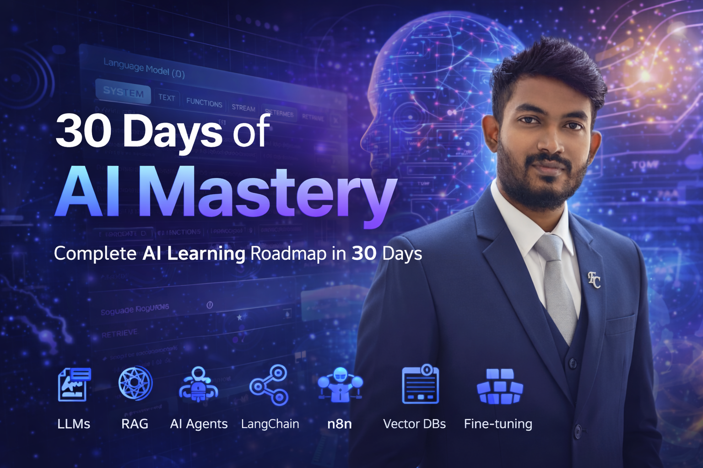

# 30 Days of AI Mastery (April 2026)

A complete, industry-level AI Engineer roadmap (April 2026 edition) covering the full modern AI stack in 30 days.

---

## Week 1 – Core Foundations (AI + LLM Internals)

**Day 1: AI Ecosystem Overview**
- AI vs ML vs Deep Learning  
- Generative AI vs Traditional AI  
- Industry use cases  

**Day 2: LLM Fundamentals**
- What is an LLM  
- Tokens & context window  
- Temperature, top-p and other decoding params  

**Day 3: Transformers Deep Dive**
- Attention mechanism  
- Self-attention  
- Encoder vs Decoder (Encoder-only, Decoder-only, Encoder–Decoder)  

**Day 4: Embeddings Deep Dive**
- Vector representations  
- Semantic meaning  
- Similarity search basics  

**Day 5: Tokenization**
- BPE, WordPiece, SentencePiece  
- Token limits  
- Cost impact of tokens  

**Day 6: Model Ecosystem**
- OpenAI models  
- Meta LLaMA  
- Google Gemini  
- Open vs Closed models  

**Day 7: Hugging Face & Open Models**
- Hugging Face ecosystem overview  
- Model Hub  
- Pipelines & inference  

---

## Week 2 – Data, Embeddings & Retrieval Systems

**Day 8: Data Preparation**
- Text cleaning  
- Dataset formats  
- Noise handling  

**Day 9: Chunking Strategies**
- Fixed chunking  
- Semantic chunking  
- Sliding window  

**Day 10: Embedding Models**
- Sentence Transformers  
- OpenAI embeddings  
- Choosing embedding models for use cases  

**Day 11: Vector Databases**
- Pinecone, Weaviate (and others)  
- Indexing basics  
- Storage strategies  

**Day 12: Similarity Search**
- Cosine similarity  
- Euclidean distance  
- ANN (FAISS, HNSW)  

**Day 13: Retrievers**
- Dense vs Sparse retrieval  
- BM25  
- Hybrid retrieval  

**Day 14: RAG Fundamentals**
- What is RAG  
- RAG architecture  
- Retrieval pipeline design  

---

## Week 3 – Advanced AI Engineering, Agents & Automation

**Day 15: Advanced RAG**
- Hybrid search  
- Re-ranking  
- Context window optimization  

**Day 16: Prompt Engineering**
- Zero-shot, few-shot  
- Chain-of-thought  
- Common prompt patterns  

**Day 17: Frameworks**
- LangChain concepts  
- Chains, tools, agents  

**Day 18: MCP (Model Context Protocol)**
- Context sharing  
- Multi-tool integration  

**Day 19: AI Agents**
- Agent architecture  
- Autonomous workflows  
- Multi-agent systems  

**Day 20: Memory Systems**
- Short-term memory  
- Long-term memory  
- Vector memory  

**Day 21: Tool Calling & APIs**
- Function / tool calling  
- External APIs  
- Tool integration patterns  

---

## Week 4 – Automation, Deployment & Advanced Topics

**Day 22: Workflow Automation (VERY IMPORTANT)**
- n8n basics  
- AI + automation workflows  
- Trigger → Action pipelines  

**Day 23: Model Providers & APIs**
- OpenRouter  
- Groq  
- API routing & usage strategies  

**Day 24: Fine-tuning**
- When to use fine-tuning  
- LoRA / PEFT basics  
- Dataset preparation  

**Day 25: Model Evaluation**
- Accuracy, BLEU, ROUGE  
- Hallucination detection  
- Benchmarking approaches  

**Day 26: Deployment**
- FastAPI basics  
- Building model APIs  
- Cloud deployment options  

**Day 27: LLMOps**
- Monitoring  
- Logging  
- Versioning and model lifecycle  

**Day 28: Multi-modal AI**
- Text + Image + Audio  
- Vision models  
- Speech models  

**Day 29: AI Safety & Guardrails**
- Bias & hallucination  
- Prompt injection  
- Safety layers & guardrails  

**Day 30: Cost & Performance Optimization**
- Token optimization  
- Caching  
- Latency optimization  

---

## What This Roadmap Covers

- **LLM internals**  
- **RAG (basic → advanced)**  
- **Vector DBs & embeddings**  
- **AI agents & memory systems**  
- **Prompt engineering**  
- **n8n automation workflows**  
- **Model providers (OpenRouter, Groq)**  
- **Fine-tuning & PEFT**  
- **Deployment & LLMOps**  
- **AI safety & guardrails**  
- **Cost & performance optimization**  

---

## Goal

To give you a complete, no-fluff AI Engineer roadmap focused on concept mastery and system understanding, not just isolated projects.

---

## Who Is This For?

- Students  
- Developers  
- AI Enthusiasts  
- Startup Founders  
- Anyone serious about modern Generative AI & AI Engineering  

---

## Support

If you find this helpful, please ⭐ star the repo and share it with others learning AI.

---
